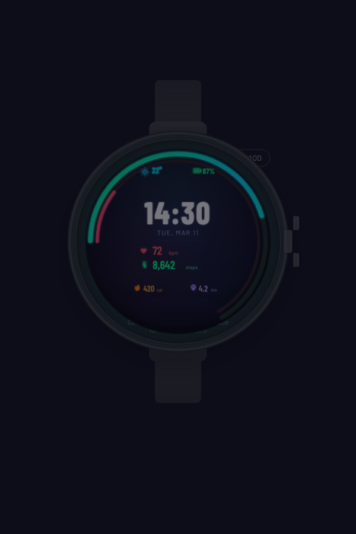
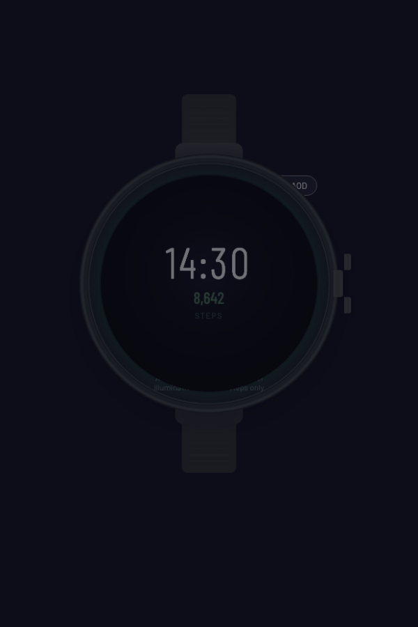

# TrailFace

Info-dense outdoor watch face for **Amazfit T-Rex 3** (ZeppOS 3.x).

<p align="center">
  
  &nbsp;&nbsp;&nbsp;
  
</p>

## Features

- **Time & Date** — 24h bold time with day/month display
- **Heart Rate** — live BPM with 10s refresh, red arc progress
- **Steps** — daily count with comma formatting, green arc progress
- **Weather** — current temperature with condition icon
- **Battery** — percentage with color-coded icon (green/yellow/red)
- **Calories** — daily kcal burned
- **Distance** — daily km walked
- **AOD Mode** — minimal always-on display showing time + steps only (<10% pixel illumination)

## Layout Zones

| Zone | Position | Content |
|------|----------|---------|
| A | Top bar | Weather (left) + Battery (right) |
| B | Center | Time + Date |
| C | Mid-left | Heart Rate + Steps with arc indicators |
| D | Bottom | Calories + Distance |
| AOD | Center | Time + Steps (dim gray on black) |

## Build & Deploy

Requires [Zeus CLI](https://docs.zepp.com/docs/guides/tools/cli/) (`@zeppos/zeus-cli`).

```bash
cd watchface
npm install
zeus build      # produces .zab in dist/
zeus preview    # QR code for sideloading via Zepp app
```

## Device Compatibility

| Device | deviceSource |
|--------|-------------|
| Amazfit T-Rex 3 | 8716544, 8716545, 8716547 |

480x480 round AMOLED, ZeppOS API Level 3.0.

## Project Structure

```
watchface/
  app.js                          App lifecycle
  app.json                        ZeppOS config
  watchface/
    index.js                      WatchFace entry point
    utils/constants.js            Colors, positions, mappings
    utils/formatters.js           Display formatting functions
    utils/sensors.js              Sensor initialization & readers
    widgets/time-widgets.js       Zone B: time + date
    widgets/status-widgets.js     Zone A: weather + battery
    widgets/metric-widgets.js     Zone C: heart rate + steps
    widgets/arc-widgets.js        Progress arc indicators
    widgets/secondary-widgets.js  Zone D: calories + distance
    widgets/aod-widgets.js        AOD-only widgets
  assets/trex3/image/             PNG icons (15 files, ~60KB)
```

## License

MIT
