# Data Model Design

> **Note:** TrailFace is a ZeppOS watch face with no persistent storage or database. This document specifies the **runtime data model** — sensor data structures held in memory during watch face execution.

## 1. Data Model Diagram

```mermaid
erDiagram
    WATCHFACE ||--|| TIME : reads
    WATCHFACE ||--|| STEPS : reads
    WATCHFACE ||--|| HEARTRATE : reads
    WATCHFACE ||--|| BATTERY : reads
    WATCHFACE ||--o| WEATHER : reads
    WATCHFACE ||--|| CALORIES : reads
    WATCHFACE ||--|| DISTANCE : reads
    WATCHFACE ||--|| DISPLAY_STATE : manages

    TIME {
        number hours "0-23"
        number minutes "0-59"
        number seconds "0-59"
        number day "1-31"
        number month "1-12"
        number year "2024+"
        number weekDay "0-6 (Sun-Sat)"
    }

    STEPS {
        number currentSteps "0-99999"
        number targetSteps "default 10000"
        number progressPercent "0.0-1.0 (derived)"
    }

    HEARTRATE {
        number currentBpm "0-255"
        number lastValidBpm "fallback value"
        number arcPercent "0.0-1.0 (derived)"
        boolean available "sensor status"
    }

    BATTERY {
        number percentage "0-100"
        string colorState "high|mid|low (derived)"
    }

    WEATHER {
        number temperatureC "degrees Celsius"
        number conditionCode "0-7"
        string iconAsset "PNG filename (derived)"
        boolean available "sync status"
    }

    CALORIES {
        number dailyCalories "kcal"
    }

    DISTANCE {
        number dailyMeters "raw meters"
        number dailyKm "derived, 1 decimal"
    }

    DISPLAY_STATE {
        number showLevel "1=normal 2=AOD 3=both"
        boolean isAod "current display mode"
    }
```



## 2. Entity Definitions

### E-01: Time

| Field | Type | Range | Source | Refresh |
|-------|------|-------|--------|---------|
| hours | number | 0-23 | `Time.getHours()` | 60s |
| minutes | number | 0-59 | `Time.getMinutes()` | 60s |
| seconds | number | 0-59 | `Time.getSeconds()` | Not used |
| day | number | 1-31 | `Time.getDay()` | 60s |
| month | number | 1-12 | `Time.getMonth()` | 60s |
| year | number | 2024+ | `Time.getYear()` | Not used |
| weekDay | number | 0-6 | `Time.getWeekDay()` | 60s |

**Derived:** `timeDisplay` (string, "HH:MM"), `dateDisplay` (string, "DAY, MON DD")

---

### E-02: Steps

| Field | Type | Range | Source | Refresh |
|-------|------|-------|--------|---------|
| currentSteps | number | 0-99999 | `Step.getCurrent()` | 60s |
| targetSteps | number | 10000 | `Step.getTarget()` | Once |

**Derived:** `progressPercent` = min(currentSteps / targetSteps, 1.0)

**Display:** Formatted with comma separator → "8,642"

---

### E-03: HeartRate

| Field | Type | Range | Source | Refresh |
|-------|------|-------|--------|---------|
| currentBpm | number | 0-255 | `HeartRate.getCurrent()` | 10s |
| lastValidBpm | number | 0-255 | `HeartRate.getLast()` | Fallback |

**Derived:**
- `available` = currentBpm > 0 || lastValidBpm > 0
- `displayBpm` = currentBpm > 0 ? currentBpm : lastValidBpm
- `arcPercent` = clamp((displayBpm - 40) / 160, 0, 1)

**Display:** If unavailable → "--"

---

### E-04: Battery

| Field | Type | Range | Source | Refresh |
|-------|------|-------|--------|---------|
| percentage | number | 0-100 | `Battery.getCurrent()` | 60s |

**Derived:**
- `colorState` = percentage > 50 → "high" (green) | > 20 → "mid" (yellow) | else → "low" (red)
- `colorHex` = { high: 0x00ff88, mid: 0xffaa00, low: 0xff4444 }

**Display:** "87%"

---

### E-05: Weather

| Field | Type | Range | Source | Refresh |
|-------|------|-------|--------|---------|
| temperatureC | number | -40 to 60 | `Weather.getForecast().current.temperature.value` | 60s |
| conditionCode | number | 0-7 | `Weather.getForecast().current.weather.index` | 60s |

**Derived:**
- `available` = getForecast() !== null
- `iconAsset` = conditionCode → icon filename mapping (see API_SPEC section 2.5)

**Display:** If unavailable → "—" for temp, hide icon

---

### E-06: Calories

| Field | Type | Range | Source | Refresh |
|-------|------|-------|--------|---------|
| dailyCalories | number | 0-9999 | `Calorie.getCurrent()` | 60s |

**Display:** "420 cal"

---

### E-07: Distance

| Field | Type | Range | Source | Refresh |
|-------|------|-------|--------|---------|
| dailyMeters | number | 0-999999 | `Distance.getCurrent()` | 60s |

**Derived:** `dailyKm` = (dailyMeters / 1000).toFixed(1)

**Display:** "4.2 km"

---

## 3. Memory Layout

All data lives in JavaScript runtime memory. No persistent storage.

```
Runtime Memory (~estimated)
├── Sensor instances (7 sensors)    ~2 KB
├── Widget references (20 widgets)  ~4 KB
├── Timer references (2 intervals)  ~0.1 KB
├── PNG assets (~15 images)         ~40 KB
├── Font rendering cache            ~100 KB
└── Total estimated                 ~150 KB (well within 2-5 MB limit)
```

---

## 4. Data Lifecycle

```
┌─────────────────────────────────────────┐
│           Watch Face Lifecycle           │
├─────────────────────────────────────────┤
│                                         │
│  onInit()                               │
│  ├─ Create sensor instances             │
│  └─ Read initial values                 │
│                                         │
│  build()                                │
│  ├─ Create all widgets (show_level)     │
│  ├─ Set initial widget values           │
│  ├─ Start 60s timer (all sensors)       │
│  └─ Start 10s timer (HR only)           │
│                                         │
│  [Running]                              │
│  ├─ 60s tick → refresh all data         │
│  ├─ 10s tick → refresh HR only          │
│  └─ Display event → toggle show_level   │
│                                         │
│  onDestroy()                            │
│  ├─ Clear intervals                     │
│  └─ Release sensor instances            │
│                                         │
└─────────────────────────────────────────┘
```

---

## 5. Traceability

| Entity | SRD Ref | Feature | Screen | API Sensor |
|--------|---------|---------|--------|------------|
| E-01 Time | E-01 | FR-01, FR-02 | S-01, S-02 | Time |
| E-02 Steps | E-02 | FR-03 | S-01, S-02 | Step |
| E-03 HeartRate | E-03 | FR-04 | S-01 | HeartRate |
| E-04 Battery | E-04 | FR-05 | S-01 | Battery |
| E-05 Weather | E-05 | FR-06 | S-01 | Weather |
| E-06 Calories | E-06 | FR-07 | S-01 | Calorie |
| E-07 Distance | E-07 | FR-08 | S-01 | Distance |

All 7 entities from SRD are covered. All 9 FRs have data sources mapped.
